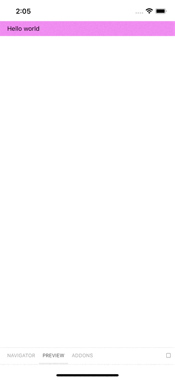

# Nx Expo + Storybook React Native

Works on iOS, and Android (but obscured by status bar). Web doesn't work, yet -- nor does MDX style stories.

Note: Also works with bare-bones RN apps very handily!



## Steps to Recreate

### 1. Generate Environment

Create normal `nx-react-native-expo` workspace + expo app, by [following the plugin instructions](https://github.com/JacopoPatroclo/nx-react-native-expo)

### 2. Adapt RN Storybook Setup Instructions

Then `cd` into your app directory and follow the (really excellent!) [`storybookjs/react-native` instructions](https://github.com/storybookjs/react-native/blob/next-6.0/v6README.md), with a couple modifications described below

Note: Install the Storybook dependencies to the root `package.json`

#### 2a. Adapt metro.config.js

The main thing `nx-react-native-expo` does is export a function make the metro config compatible with the Nx monorepo, so the instructions from `storybookjs/react-native` need to be adapted like so:

```
const { withNxMetro } = require('nx-react-native-expo');
const { getDefaultConfig } = require('@expo/metro-config');

const defaultConfig = getDefaultConfig(__dirname);


defaultConfig.resolver.resolverMainFields.push('sbmodern', 'main');
defaultConfig.transformer.getTransformOptions = async () => ({
  transform: {
    experimentalImportSupport: false,
    inlineRequires: false,
  }
})

module.exports = withNxMetro(defaultConfig);
```

#### 2b. Create Nx workspace command for 'prestart'

Add the `prestart` command from the `storybookjs/react-native` instructions as a workspace command with a `cwd` definition pointing to your app directory.

You'll need this in order for new stories to populate into the `storybook.requires.js`

```
        "prestart": {
          "executor": "@nrwl/workspace:run-commands",
          "options": {
            "commands": ["sbn-get-stories"],
            "cwd": "apps/expo-test-app"
          }
        },
```

### 3. Start Apps

`yarn nx run expo-test-app:run-ios`
`yarn nx run expo-test-app:run-android`

## Next Steps

- [ ] try with library
- [ ] try with root level config inheritance (like @nrwl/storybook)
- [ ] look into MDX support
- [ ] look into web support
- [ ] create generator/schematic?
- [ ] Add `SafeAreaView` to fix android overlapping with status bar
